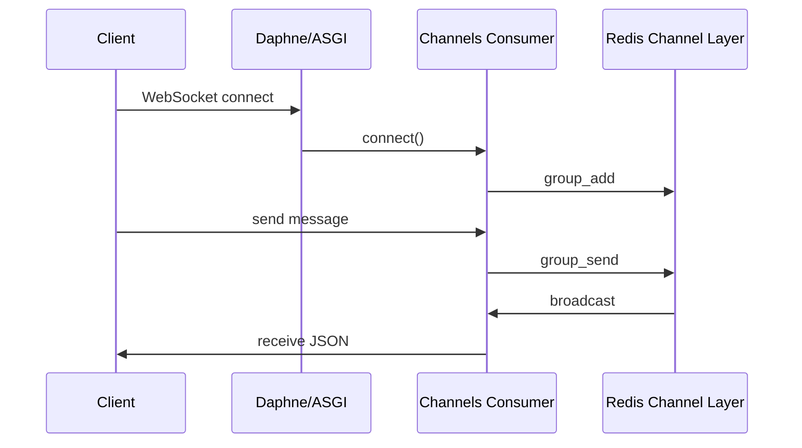

# Async Django & Channels

Modern Django supports async views and ASGI deployment. **Django Channels** adds WebSockets and background protocol handling.

## ASGI vs WSGI

| | WSGI | ASGI |
|---|------|------|
| Concurrency | Sync (thread per request) | Async (event loop) |
| Protocols | HTTP only | HTTP, WebSockets, etc. |
| Entry | `wsgi.py` | `asgi.py` |

```python
# asgi.py
import os
from django.core.asgi import get_asgi_application

os.environ.setdefault('DJANGO_SETTINGS_MODULE', 'myproject.settings')
application = get_asgi_application()
```

Deploy with **Uvicorn** or **Daphne** instead of Gunicorn (sync).

## Async Views (Django 3.1+)

```python
import asyncio
from django.http import JsonResponse

async def async_stats(request):
    # Run sync ORM in thread pool when needed
    from asgiref.sync import sync_to_async

    count = await sync_to_async(Post.objects.count)()
    return JsonResponse({'count': count})

# urls.py
path('stats/', async_stats),
```

### Database note
Django's ORM is still largely sync — use `sync_to_async` or async-compatible drivers carefully.

## Django Channels Setup

```bash
pip install channels channels-redis
```

```python
# settings.py
INSTALLED_APPS = ['channels', ...]
ASGI_APPLICATION = 'myproject.asgi.application'

CHANNEL_LAYERS = {
    'default': {
        'BACKEND': 'channels_redis.core.RedisChannelLayer',
        'CONFIG': {'hosts': [('127.0.0.1', 6379)]},
    },
}
```

```python
# asgi.py
from channels.routing import ProtocolTypeRouter, URLRouter
from channels.auth import AuthMiddlewareStack
from django.core.asgi import get_asgi_application
import chat.routing

django_asgi_app = get_asgi_application()

application = ProtocolTypeRouter({
    'http': django_asgi_app,
    'websocket': AuthMiddlewareStack(
        URLRouter(chat.routing.websocket_urlpatterns)
    ),
})
```

## WebSocket Consumer

```python
# chat/consumers.py
import json
from channels.generic.websocket import AsyncWebsocketConsumer

class ChatConsumer(AsyncWebsocketConsumer):
    async def connect(self):
        self.room_name = self.scope['url_route']['kwargs']['room']
        self.room_group = f'chat_{self.room_name}'
        await self.channel_layer.group_add(self.room_group, self.channel_name)
        await self.accept()

    async def disconnect(self, close_code):
        await self.channel_layer.group_discard(self.room_group, self.channel_name)

    async def receive(self, text_data):
        data = json.loads(text_data)
        await self.channel_layer.group_send(
            self.room_group,
            {'type': 'chat_message', 'message': data['message']}
        )

    async def chat_message(self, event):
        await self.send(text_data=json.dumps({'message': event['message']}))
```

```python
# chat/routing.py
from django.urls import re_path
from . import consumers

websocket_urlpatterns = [
    re_path(r'ws/chat/(?P<room>\w+)/$', consumers.ChatConsumer.as_asgi()),
]
```

## WebSocket Flow



## When to Use What

| Need | Solution |
|------|----------|
| Traditional HTTP API | WSGI + Gunicorn |
| Long-polling / many concurrent HTTP | ASGI + Uvicorn |
| WebSockets, chat, live updates | Django Channels |
| Background jobs | Celery (not Channels) |

## Best Practices

### ✅ DO
- Use Redis channel layer in production (not in-memory)
- Authenticate WebSocket connections (`AuthMiddlewareStack`)
- Offload heavy work to Celery

### ❌ DON'T
- Don't block the event loop with sync I/O
- Don't use Channels for simple CRUD REST
- Don't skip heartbeat/reconnect handling on clients

## Related Notes
- [Project vs App Structure](/learning/django-project-vs-app-structure) - ASGI entry point
- [Django Signals](/learning/django-signals) - Decoupled events
- [DRF Architecture Overview](/learning/django-drf-architecture-overview) - REST vs WebSockets
