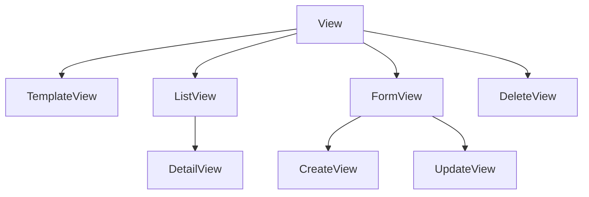

# Class-Based Views (CBV)

CBVs use inheritance and mixins to reuse behavior. Django provides generic views for common CRUD patterns.

## Basic CBV

```python
from django.views import View
from django.http import JsonResponse

class PostListView(View):
    def get(self, request):
        posts = Post.objects.filter(is_published=True)
        data = [{'id': p.id, 'title': p.title} for p in posts]
        return JsonResponse(data, safe=False)

    def post(self, request):
        # handle POST
        ...
```

## Generic Display Views

```python
from django.views.generic import ListView, DetailView

class PostListView(ListView):
    model = Post
    template_name = 'blog/post_list.html'
    context_object_name = 'posts'
    queryset = Post.objects.filter(is_published=True)
    paginate_by = 10

class PostDetailView(DetailView):
    model = Post
    template_name = 'blog/post_detail.html'
    context_object_name = 'post'
```

## Generic Editing Views

```python
from django.views.generic.edit import CreateView, UpdateView, DeleteView
from django.urls import reverse_lazy

class PostCreateView(CreateView):
    model = Post
    fields = ['title', 'body', 'slug']
    template_name = 'blog/post_form.html'
    success_url = reverse_lazy('post-list')

class PostUpdateView(UpdateView):
    model = Post
    fields = ['title', 'body']
    template_name = 'blog/post_form.html'

class PostDeleteView(DeleteView):
    model = Post
    success_url = reverse_lazy('post-list')
```

## Mixins

```python
from django.contrib.auth.mixins import LoginRequiredMixin, UserPassesTestMixin

class PostUpdateView(LoginRequiredMixin, UserPassesTestMixin, UpdateView):
    model = Post
    fields = ['title', 'body']

    def test_func(self):
        return self.request.user == self.get_object().author
```

## Overriding Hooks

```python
class PostCreateView(LoginRequiredMixin, CreateView):
    model = Post
    fields = ['title', 'body']

    def form_valid(self, form):
        form.instance.author = self.request.user
        return super().form_valid(form)

    def get_context_data(self, **kwargs):
        context = super().get_context_data(**kwargs)
        context['page_title'] = 'New Post'
        return context
```

## CBV Hierarchy (simplified)



Reference: [Classy Class-Based Views](https://ccbv.co.uk/)

## Method Resolution Order

HTTP verb maps to method: `GET` → `get()`, `POST` → `post()`, etc.

```python
class MyView(View):
    def dispatch(self, request, *args, **kwargs):
        # Runs before get/post — auth, logging
        return super().dispatch(request, *args, **kwargs)
```

## Best Practices

### ✅ DO
- Use generic views for standard CRUD
- Override `get_queryset()` to scope data per user
- Combine mixins for auth and permissions

### ❌ DON'T
- Don't use CBV when a 5-line FBV is clearer
- Don't override `__init__` for request-specific logic — use `setup()` or `dispatch()`
- Don't skip `LoginRequiredMixin` on sensitive views

## Related Notes
- [Function Based Views](/learning/django-function-based-views) - FBV comparison
- [API Views and ViewSets](/learning/django-api-views-and-viewsets) - DRF ViewSets
- [Middleware Chain](/learning/django-middleware-chain) - Cross-cutting concerns
