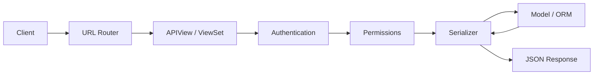

# DRF Architecture Overview

**Django REST Framework (DRF)** extends Django to build Web APIs with serialization, authentication, browsable API, and view abstractions.

## Install & Configure

```bash
pip install djangorestframework
```

```python
# settings.py
INSTALLED_APPS = [
    ...
    'rest_framework',
]

REST_FRAMEWORK = {
    'DEFAULT_PERMISSION_CLASSES': [
        'rest_framework.permissions.IsAuthenticatedOrReadOnly',
    ],
    'DEFAULT_PAGINATION_CLASS': 'rest_framework.pagination.PageNumberPagination',
    'PAGE_SIZE': 20,
}
```

## DRF Request Flow



## Core Components

| Component | Role |
|-----------|------|
| **Serializer** | Convert models ↔ JSON, validate input |
| **APIView** | Base class with `request.data`, `Response` |
| **ViewSet** | CRUD actions (`list`, `create`, `retrieve`, …) |
| **Router** | Auto-generate URL patterns for ViewSets |
| **Permission** | Authorization checks |
| **Authentication** | Identity (Session, Token, JWT) |

## Minimal API Example

```python
# serializers.py
from rest_framework import serializers
from .models import Task

class TaskSerializer(serializers.ModelSerializer):
    class Meta:
        model = Task
        fields = ['id', 'title', 'completed', 'created_at']

# views.py
from rest_framework import viewsets
from .models import Task
from .serializers import TaskSerializer

class TaskViewSet(viewsets.ModelViewSet):
    queryset = Task.objects.all()
    serializer_class = TaskSerializer

# urls.py
from rest_framework.routers import DefaultRouter
from .views import TaskViewSet

router = DefaultRouter()
router.register(r'tasks', TaskViewSet)

urlpatterns = [
    path('api/', include(router.urls)),
]
```

Endpoints:
- `GET /api/tasks/` — list
- `POST /api/tasks/` — create
- `GET /api/tasks/1/` — detail
- `PUT/PATCH /api/tasks/1/` — update
- `DELETE /api/tasks/1/` — delete

## Response Objects

```python
from rest_framework.response import Response
from rest_framework import status

return Response({'message': 'Created'}, status=status.HTTP_201_CREATED)
return Response(serializer.errors, status=status.HTTP_400_BAD_REQUEST)
```

## Browsable API

DRF renders HTML forms in the browser during development — invaluable for debugging. Disable in production or restrict access.

## REST Design Conventions

| Method | Action | Status |
|--------|--------|--------|
| GET | Read | 200 |
| POST | Create | 201 |
| PUT/PATCH | Update | 200 |
| DELETE | Remove | 204 |

Use nouns for resources (`/tasks/`), not verbs (`/getTasks/`).

## Best Practices

### ✅ DO
- Version APIs (`/api/v1/`)
- Paginate list endpoints
- Use ViewSets + Routers for standard CRUD
- Return consistent error shapes

### ❌ DON'T
- Don't expose raw models without serializers
- Don't skip permission classes on write endpoints
- Don't use `AllowAny` globally in production

## Related Notes
- [Serializers Deep Dive](/learning/django-serializers-deep-dive) - Serialization
- [API Views and ViewSets](/learning/django-api-views-and-viewsets) - View patterns
- [Authentication Permissions](/learning/django-authentication-permissions) - Auth & permissions
