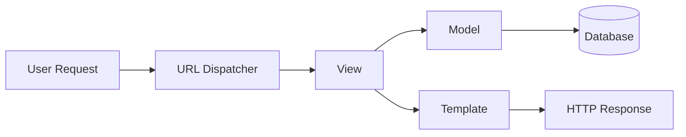

# Django Master Note 🎯

> **Django** is a high-level Python web framework that encourages rapid development and clean, pragmatic design.

## What is Django?

Django is a batteries-included framework that provides everything needed to build web applications: ORM, authentication, admin interface, security features, and more. It follows the **"Don't Repeat Yourself" (DRY)** principle and emphasizes reusability.

### Why Django?
- ✅ **Batteries included** - Built-in admin, authentication, ORM
- ✅ **Security by default** - CSRF, XSS, SQL injection protection
- ✅ **Scalable** - Used by Instagram, Pinterest, Disqus
- ✅ **Great documentation** - Comprehensive and well-maintained

## Architecture: Model-View-Template (MVT)



## 🎓 Learning Paths (Choose Your Track)

### 🟢 Track 1: "I'm completely new to Django"
**Time: 2-3 days**

1. Start here → [Project vs App Structure](/learning/django-project-vs-app-structure)
2. [The MVT Pattern](/learning/django-the-mvt-pattern) - Understand the pattern
3. [Django CLI and Manage](/learning/django-cli-and-manage) - Learn essential commands
4. [Model Definitions Fields](/learning/django-model-definitions-fields) - Create your first models
5. [Database Migrations](/learning/django-database-migrations) - Migrate your database
6. [QuerySets and Managers](/learning/django-querysets-and-managers) - Query your data

**Build**: A simple blog application

---

### 🟡 Track 2: "I need to build a REST API"
**Time: 3-4 days**

**Prerequisites**: Track 1 completion

1. [DRF Architecture Overview](/learning/django-drf-architecture-overview) - Understanding REST with Django
2. [Serializers Deep Dive](/learning/django-serializers-deep-dive) - Data serialization
3. [API Views and ViewSets](/learning/django-api-views-and-viewsets) - API endpoints
4. [Authentication Permissions](/learning/django-authentication-permissions) - Secure your API

**Build**: A task management API with JWT auth

---

### 🔴 Track 3: "I'm optimizing for production"
**Time: 2 days**

**Prerequisites**: Track 1 + Track 2

1. [Advanced ORM Optimization](/learning/django-advanced-orm-optimization) - Fix N+1 queries
2. [Security Best Practices](/learning/django-security-best-practices) - Production security
3. [Django Signals](/learning/django-signals) - Decouple business logic
4. [Async Django and Channels](/learning/django-async-django-and-channels) - Real-time features

**Build**: Optimize an existing app + add WebSockets

---

### 🟣 Track 4: "I need to customize existing Django apps"
**Time: 1-2 days**

**Prerequisites**: Basic Django knowledge

1. [Class Based Views](/learning/django-class-based-views) - Override generic views
2. [Middleware Chain](/learning/django-middleware-chain) - Add cross-cutting concerns
3. [Django Signals](/learning/django-signals) - React to model changes
4. [Django CLI and Manage](/learning/django-cli-and-manage) - Create custom commands

**Build**: Custom admin actions and management commands

---

## 📚 Content Index

### Core Foundations
- [Project vs App Structure](/learning/django-project-vs-app-structure) - Project structure, settings, entry points
- [The MVT Pattern](/learning/django-the-mvt-pattern) - Deep dive into Model-View-Template
- [Django CLI and Manage](/learning/django-cli-and-manage) - Essential commands and custom management

### Data & ORM
- [Model Definitions Fields](/learning/django-model-definitions-fields) - Field types, relationships, validators
- [Database Migrations](/learning/django-database-migrations) - Migration system internals
- [QuerySets and Managers](/learning/django-querysets-and-managers) - Query patterns and custom managers
- [Advanced ORM Optimization](/learning/django-advanced-orm-optimization) - Performance optimization

### Views & Routing
- [URL Routing and Resolvers](/learning/django-url-routing-and-resolvers) - URL patterns, converters, namespaces
- [Function Based Views](/learning/django-function-based-views) - FBV patterns and decorators
- [Class Based Views](/learning/django-class-based-views) - CBV hierarchy and mixins
- [Middleware Chain](/learning/django-middleware-chain) - Custom middleware creation

### Django REST Framework
- [DRF Architecture Overview](/learning/django-drf-architecture-overview) - REST concepts with Django
- [Serializers Deep Dive](/learning/django-serializers-deep-dive) - Serialization and validation
- [API Views and ViewSets](/learning/django-api-views-and-viewsets) - API view patterns
- [Authentication Permissions](/learning/django-authentication-permissions) - Authentication and permissions

### Advanced & Ecosystem
- [Django Signals](/learning/django-signals) - Event-driven programming
- [Security Best Practices](/learning/django-security-best-practices) - Security hardening
- [Async Django and Channels](/learning/django-async-django-and-channels) - Async views and WebSockets

## 🛠️ Quick Reference

### Essential Commands
```bash
# Project management
django-admin startproject project_name
python manage.py startapp app_name
python manage.py runserver

# Database
python manage.py makemigrations
python manage.py migrate
python manage.py createsuperuser

# Debug
python manage.py shell
python manage.py check
```

### Common Patterns
- **FBV**: Use for simple, stateless views
- **CBV**: Use for CRUD operations and reusable behavior
- **DRF ViewSet**: Use for REST APIs with standard actions
- **Custom Manager**: Use for complex query logic

## 🔗 External Resources

- [Official Documentation](https://docs.djangoproject.com/)
- [Django REST Framework Docs](https://www.django-rest-framework.org/)
- [Django Girls Tutorial](https://tutorial.djangogirls.org/) - Great for beginners
- [Classy Class-Based Views](https://ccbv.co.uk/) - CBV reference

## 📝 Notes

- All notes use 🟢 for beginner, 🟡 for intermediate, 🔴 for advanced content
- Each note includes practical examples and anti-patterns
- Focus on understanding "why" not just "how"

---

*Last updated: {{date}}*
