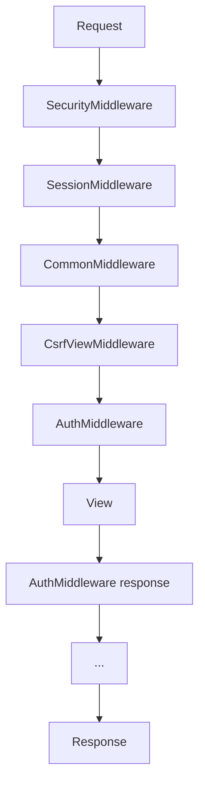

# Middleware Chain

Middleware is a framework of hooks into Django's request/response processing. Each middleware can modify the request, short-circuit with a response, or process the response on the way out.

## Request/Response Flow



## Configuration

```python
# settings.py — order matters!
MIDDLEWARE = [
    'django.middleware.security.SecurityMiddleware',
    'django.contrib.sessions.middleware.SessionMiddleware',
    'django.middleware.common.CommonMiddleware',
    'django.middleware.csrf.CsrfViewMiddleware',
    'django.contrib.auth.middleware.AuthenticationMiddleware',
    'django.contrib.messages.middleware.MessageMiddleware',
    'django.middleware.clickjacking.XFrameOptionsMiddleware',
    'myapp.middleware.RequestTimingMiddleware',
]
```

## Custom Middleware (new style)

```python
# myapp/middleware.py
import time
import logging

logger = logging.getLogger(__name__)

class RequestTimingMiddleware:
    def __init__(self, get_response):
        self.get_response = get_response

    def __call__(self, request):
        start = time.perf_counter()
        response = self.get_response(request)
        duration = time.perf_counter() - start
        logger.info('%s %s %.3fs', request.method, request.path, duration)
        response['X-Request-Time'] = f'{duration:.3f}'
        return response
```

## Middleware Hooks

| Hook | When |
|------|------|
| `__call__` | Every request/response |
| `process_view` | Before view runs (can return HttpResponse) |
| `process_exception` | View raised exception |
| `process_template_response` | TemplateResponse rendered |

```python
class AdminOnlyMiddleware:
    def __init__(self, get_response):
        self.get_response = get_response

    def __call__(self, request):
        return self.get_response(request)

    def process_view(self, request, view_func, view_args, view_kwargs):
        if request.path.startswith('/admin/') and not request.user.is_staff:
            from django.http import HttpResponseForbidden
            return HttpResponseForbidden()
```

## Common Built-in Middleware

| Middleware | Purpose |
|------------|---------|
| `SecurityMiddleware` | HTTPS redirect, security headers |
| `SessionMiddleware` | Session support |
| `CsrfViewMiddleware` | CSRF token validation |
| `AuthenticationMiddleware` | Adds `request.user` |
| `MessageMiddleware` | Flash messages |

## Third-Party Examples

```python
# CORS (django-cors-headers) — place high in list
'corsheaders.middleware.CorsMiddleware',

# WhiteNoise — serve static files
'whitenoise.middleware.WhiteNoiseMiddleware',
```

## Best Practices

### ✅ DO
- Keep middleware fast — runs on every request
- Document ordering dependencies
- Use middleware for cross-cutting concerns (logging, timing, locale)

### ❌ DON'T
- Don't put business logic in middleware
- Don't perform heavy DB work on every request
- Don't reorder CSRF/Session middleware without understanding impact

## Related Notes
- [Project vs App Structure](/learning/django-project-vs-app-structure) - MIDDLEWARE in settings
- [Security Best Practices](/learning/django-security-best-practices) - Security headers
- [Function Based Views](/learning/django-function-based-views) - Views run after middleware
