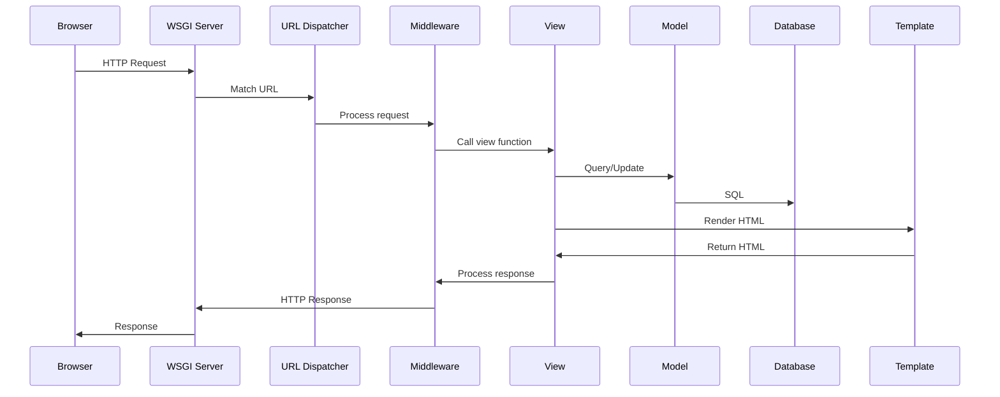

# Project vs App Structure

## The Difference

- **Project**: The entire website/application container
- **App**: A specific module/feature within the project

```python
myproject/                 # PROJECT (container)
├── manage.py
├── myproject/            # PROJECT CONFIG
│   ├── settings.py
│   ├── urls.py
│   └── wsgi.py
├── blog/                 # APP 1 (blog feature)
│   ├── models.py
│   ├── views.py
│   └── ...
└── shop/                 # APP 2 (ecommerce feature)
    ├── models.py
    └── ...
```

## Project Structure Deep Dive

### `manage.py`
Entry point for all Django commands
```bash
python manage.py runserver
python manage.py shell
python manage.py migrate
```

### `settings.py` - Critical Configurations

```python
# Core settings
DEBUG = True  # NEVER in production!
ALLOWED_HOSTS = ['localhost', '127.0.0.1']

# Apps registration
INSTALLED_APPS = [
    'django.contrib.admin',
    'django.contrib.auth',
    'myapp',  # Your custom app
]

# Database
DATABASES = {
    'default': {
        'ENGINE': 'django.db.backends.postgresql',
        'NAME': 'mydb',
        'USER': 'user',
        'PASSWORD': 'pass',
    }
}

# Middleware (order matters!)
MIDDLEWARE = [
    'django.middleware.security.SecurityMiddleware',
    'django.contrib.sessions.middleware.SessionMiddleware',
    'django.middleware.common.CommonMiddleware',
    'django.middleware.csrf.CsrfViewMiddleware',
]

# Templates
TEMPLATES = [
    {
        'BACKEND': 'django.template.backends.django.DjangoTemplates',
        'DIRS': [BASE_DIR / 'templates'],  # Global templates
        'APP_DIRS': True,  # Look in app/templates/
        'OPTIONS': {
            'context_processors': [
                'django.template.context_processors.debug',
                'django.template.context_processors.request',
            ],
        },
    },
]
```

### URL Dispatcher (`urls.py`)

```python
from django.urls import path, include

urlpatterns = [
    path('admin/', admin.site.urls),
    path('blog/', include('blog.urls')),  # Delegate to app
    path('api/', include('api.urls')),
]
```

## App Structure

```python
myapp/
├── migrations/        # Database migrations
├── __init__.py
├── admin.py          # Admin interface config
├── apps.py           # App configuration
├── models.py         # Database models
├── views.py          # Request handlers
├── urls.py           # App-specific URLs
├── tests.py          # Unit tests
└── templates/        # App-specific templates
    └── myapp/
```

## Request Lifecycle



## Best Practices

### ✅ DO
- Keep apps focused on a single responsibility
- Use `include()` for URL modularity
- Use environment variables for secrets in settings
- Separate settings for development/production

### ❌ DON'T
- Don't put business logic in settings.py
- Don't create monolithic apps (e.g., "core" app)
- Don't hardcode sensitive information

## Practical Example: Creating Structure

```bash
# Create project
django-admin startproject myproject
cd myproject

# Create apps
python manage.py startapp users
python manage.py startapp products
python manage.py startapp orders

# Result structure
myproject/
├── users/     # Authentication, profiles
├── products/  # Product catalog
└── orders/    # Shopping cart, checkout
```

## Common Configurations

### Environment-specific settings
```python
# settings/base.py (shared)
# settings/development.py
from .base import *

DEBUG = True
DATABASES = {
    'default': {
        'ENGINE': 'django.db.backends.sqlite3',
        'NAME': BASE_DIR / 'db.sqlite3',
    }
}

# settings/production.py  
from .base import *

DEBUG = False
ALLOWED_HOSTS = ['.herokuapp.com']
```

## WSGI vs ASGI

- **WSGI**: Synchronous, standard for traditional Django
- **ASGI**: Asynchronous, needed for WebSockets and long-polling

```python
# wsgi.py - Synchronous entry point
application = get_wsgi_application()

# asgi.py - Async entry point
application = get_asgi_application()
```

## Related Notes
- [The MVT Pattern](/learning/django-the-mvt-pattern) - Understanding the pattern
- [Django CLI and Manage](/learning/django-cli-and-manage) - Command reference
