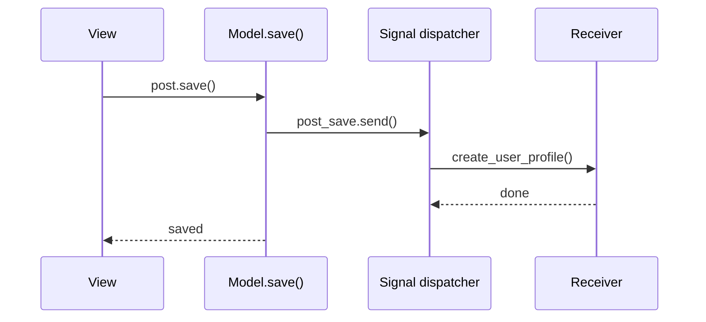

# Django Signals

Signals allow decoupled applications to get notified when certain actions occur elsewhere in the framework (e.g., model saved, user logged in).

## Built-in Signals

| Signal | Sent when |
|--------|-----------|
| `pre_save` / `post_save` | Model instance saved |
| `pre_delete` / `post_delete` | Model instance deleted |
| `m2m_changed` | ManyToMany changed |
| `request_started` / `request_finished` | HTTP request lifecycle |
| `user_logged_in` | User authenticates |

## Connecting Receivers

```python
# models.py or signals.py
from django.db.models.signals import post_save
from django.dispatch import receiver
from .models import User, Profile

@receiver(post_save, sender=User)
def create_user_profile(sender, instance, created, **kwargs):
    if created:
        Profile.objects.create(user=instance)
```

## Register in AppConfig

```python
# apps.py
from django.apps import AppConfig

class UsersConfig(AppConfig):
    default_auto_field = 'django.db.models.BigAutoField'
    name = 'users'

    def ready(self):
        import users.signals  # noqa: F401 — register receivers
```

## Custom Signals

```python
# signals.py
from django.dispatch import Signal

order_placed = Signal()  # providing_args deprecated; pass via send()

# Sender
order_placed.send(sender=self.__class__, order=order, user=request.user)

# Receiver
@receiver(order_placed)
def send_confirmation_email(sender, order, user, **kwargs):
    ...
```

## `post_save` Example

```python
@receiver(post_save, sender=Post)
def invalidate_cache(sender, instance, **kwargs):
    cache.delete(f'post:{instance.pk}')
```

## Signal Flow



## Alternatives to Signals

| Approach | When |
|----------|------|
| Override `Model.save()` | Logic tightly coupled to one model |
| Service layer | Explicit orchestration, easier to test |
| Celery tasks | Async side effects (emails, indexing) |
| `transaction.on_commit()` | Run after DB commit succeeds |

```python
from django.db import transaction

def place_order(order):
    order.save()
    transaction.on_commit(lambda: send_order_email.delay(order.id))
```

## Best Practices

### ✅ DO
- Keep receivers idempotent when possible
- Use `transaction.on_commit()` for external side effects
- Import signals in `AppConfig.ready()`

### ❌ DON'T
- Don't put heavy logic in signals (hard to debug, implicit)
- Don't create circular imports
- Don't rely on signal order between receivers

## Related Notes
- [Model Definitions Fields](/learning/django-model-definitions-fields) - Models that emit signals
- [Async Django and Channels](/learning/django-async-django-and-channels) - Async side effects
- [Class Based Views](/learning/django-class-based-views) - Explicit hooks vs signals
