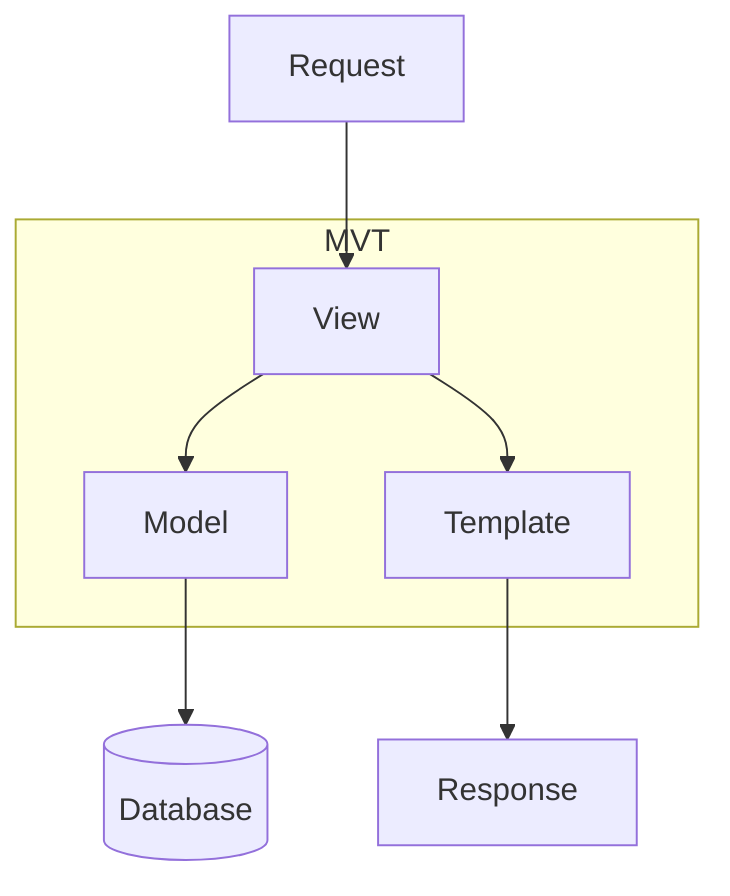
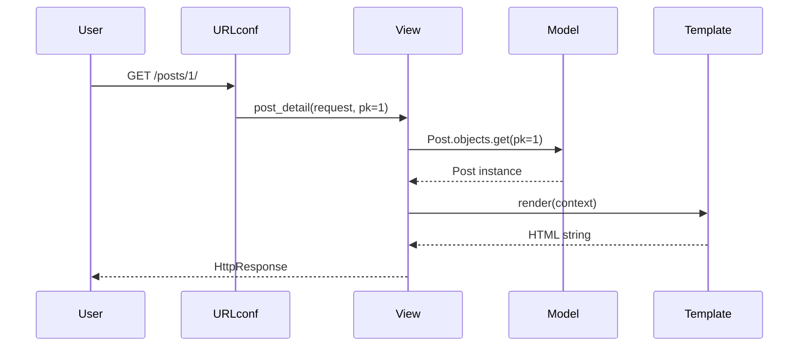

# The MVT Pattern

Django uses **Model-View-Template (MVT)** — a variant of MVC where Django's "View" is the controller and "Template" is the presentation layer.

## MVT vs MVC

| MVC | MVT (Django) | Responsibility |
|-----|--------------|----------------|
| Model | **Model** | Data structure, ORM, business rules |
| Controller | **View** | Request handling, logic orchestration |
| View | **Template** | HTML presentation |



## Model Layer

Defines data structure and database interaction.

```python
# models.py
from django.db import models

class Post(models.Model):
    title = models.CharField(max_length=200)
    body = models.TextField()
    published = models.BooleanField(default=False)
    created_at = models.DateTimeField(auto_now_add=True)

    def __str__(self):
        return self.title
```

**Responsibilities:**
- Define schema and relationships
- Encapsulate data validation (`clean()`)
- Provide query API via managers

## View Layer

Processes HTTP requests and returns responses. Can be function-based or class-based.

```python
# views.py
from django.shortcuts import render, get_object_or_404
from .models import Post

def post_detail(request, pk):
    post = get_object_or_404(Post, pk=pk)
    return render(request, 'blog/post_detail.html', {'post': post})
```

**Responsibilities:**
- Parse request data
- Call models / services
- Choose response type (HTML, JSON, redirect)
- Enforce permissions

## Template Layer

Renders HTML with dynamic context.

```html
<!-- templates/blog/post_detail.html -->
<h1>{{ post.title }}</h1>
<p>{{ post.body }}</p>
<p>Published: {{ post.created_at|date:"M d, Y" }}</p>
```

**Responsibilities:**
- Display data (no heavy business logic)
- Use template tags and filters
- Extend base layouts (``)

## How They Connect

```python
# urls.py → views.py → models.py + template
urlpatterns = [
    path('posts/<int:pk>/', views.post_detail, name='post-detail'),
]
```



## API / DRF Variant

For REST APIs, **Template** is replaced by **Serializer** (JSON output):

```
Request → URL → View → Serializer ↔ Model → JSON Response
```

See [DRF Architecture Overview](/learning/django-drf-architecture-overview) for the DRF flow.

## Best Practices

### ✅ DO
- Keep views thin; move complex logic to services or models
- Use templates only for presentation
- Put reusable query logic in custom managers

### ❌ DON'T
- Don't put SQL in templates
- Don't put HTML generation in views (use templates)
- Don't duplicate business rules across views

## Related Notes
- [Project vs App Structure](/learning/django-project-vs-app-structure) - Where MVT files live
- [Function Based Views](/learning/django-function-based-views) / [Class Based Views](/learning/django-class-based-views) - View patterns
- [Model Definitions Fields](/learning/django-model-definitions-fields) - Model deep dive
