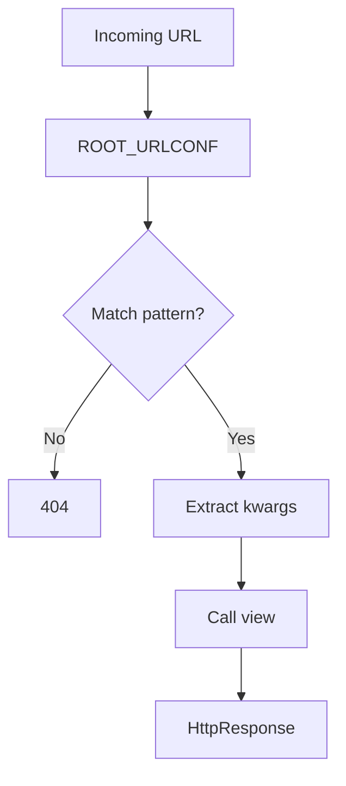

# URL Routing & Resolvers

Django maps URL patterns to views using `urlpatterns`. The URL dispatcher runs after middleware and before the view.

## Basic Patterns

```python
# myproject/urls.py
from django.urls import path, re_path, include
from blog import views

urlpatterns = [
    path('', views.home, name='home'),
    path('posts/<int:pk>/', views.post_detail, name='post-detail'),
    path('posts/<slug:slug>/', views.post_by_slug, name='post-by-slug'),
    path('blog/', include('blog.urls')),
]
```

## Path Converters

| Converter | Matches |
|-----------|---------|
| `str` | Any non-empty string (default) |
| `int` | Positive integers |
| `slug` | Slug: letters, numbers, hyphens, underscores |
| `uuid` | UUID strings |
| `path` | Like `str` but includes `/` |

### Custom converter

```python
# converters.py
class FourDigitYearConverter:
    regex = r'[0-9]{4}'

    def to_python(self, value):
        return int(value)

    def to_url(self, value):
        return '%04d' % value

# register in urls.py
from django.urls import register_converter
register_converter(FourDigitYearConverter, 'yyyy')
path('archive/<yyyy:year>/', views.archive),
```

## Named URLs & Reverse

```python
# In views
from django.urls import reverse
from django.shortcuts import redirect

def create_post(request):
    ...
    return redirect('post-detail', pk=post.pk)

# In templates

```

## Namespaces

```python
# project urls.py
urlpatterns = [
    path('blog/', include('blog.urls', namespace='blog')),
]

# blog/urls.py
app_name = 'blog'
urlpatterns = [
    path('', views.index, name='index'),
]

# Reverse: 'blog:index'
reverse('blog:index')

```

## `re_path` (regex)

```python
from django.urls import re_path

urlpatterns = [
    re_path(r'^articles/(?P<year>[0-9]{4})/$', views.year_archive),
]
```

Prefer `path()` for readability; use `re_path()` for legacy or complex patterns.

## Request Flow



## Best Practices

### ✅ DO
- Name every public URL (`name='...'`)
- Use `include()` to split URLconf per app
- Use namespaces when including the same app twice

### ❌ DON'T
- Don't hardcode URLs in Python/templates — use `reverse()` / ``
- Don't put business logic in `urls.py`
- Don't duplicate URL patterns across apps without namespaces

## Related Notes
- [Function Based Views](/learning/django-function-based-views) - View handlers
- [Project vs App Structure](/learning/django-project-vs-app-structure) - Root vs app urls
- [Middleware Chain](/learning/django-middleware-chain) - Runs before URL resolution completes
