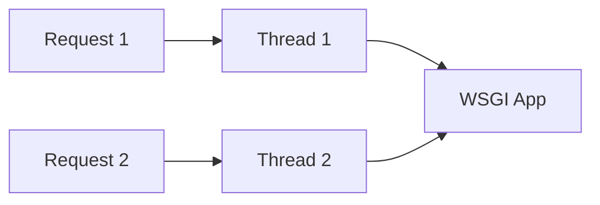
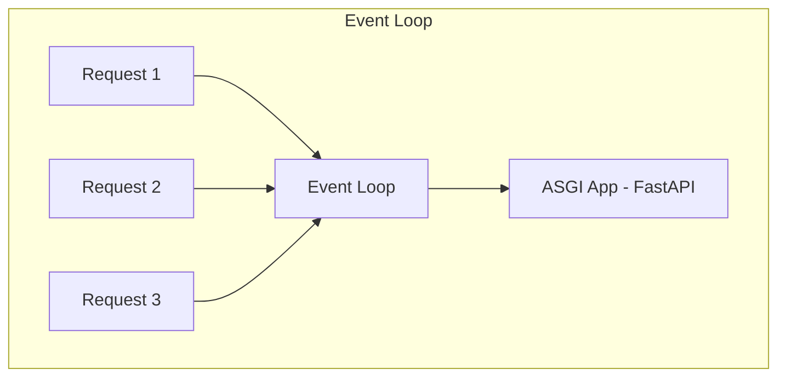

# ASGI vs WSGI

FastAPI runs on **ASGI** (Asynchronous Server Gateway Interface). Django traditionally ran on **WSGI** (synchronous). Understanding this difference explains why FastAPI is fast and why async discipline matters.

## WSGI (The Old Way)

- **One request → one thread** (blocking)
- HTTP only
- Mature ecosystem (Gunicorn + Django)



While Request 1 waits on the database, its thread sits idle — but still consumes memory.

## ASGI (The FastAPI Way)

- **Event loop** handles many concurrent connections
- Supports HTTP, WebSockets, and long-lived connections
- Non-blocking I/O while waiting on DB, APIs, files



While Request 1 awaits the database, the loop serves Request 2 and 3.

## The Stack

| Layer | Role |
|-------|------|
| **Uvicorn** | ASGI server (runs your app) |
| **Starlette** | ASGI toolkit (routing, middleware, WebSockets) |
| **FastAPI** | API layer on top of Starlette (validation, DI, OpenAPI) |

```python
# main.py
from fastapi import FastAPI

app = FastAPI()  # Built on Starlette
```

```bash
uvicorn main:app --reload          # Development
uvicorn main:app --workers 4       # Production (multi-process)
```

## Minimal ASGI App (No FastAPI)

```python
async def app(scope, receive, send):
    if scope['type'] == 'http':
        await send({
            'type': 'http.response.start',
            'status': 200,
            'headers': b'content-type', b'text/plain',
        })
        await send({
            'type': 'http.response.body',
            'body': b'Hello, ASGI!',
        })
```

FastAPI abstracts this — but your app still runs on the same model.

## Deployment Comparison

| Server | Interface | Typical use |
|--------|-----------|-------------|
| Gunicorn | WSGI | Django sync apps |
| Uvicorn | ASGI | FastAPI, Starlette |
| Hypercorn | ASGI | Alternative ASGI server |
| Gunicorn + Uvicorn workers | ASGI | Production FastAPI pattern |

```bash
gunicorn main:app -k uvicorn.workers.UvicornWorker -w 4
```

## Combat Tip: Don't Fake Async

Running blocking code inside `async def` **blocks the entire event loop** for all users. See [Async Await Deep Dive](/learning/fastapi-async-await-deep-dive).

## Best Practices

### ✅ DO
- Run FastAPI behind Uvicorn (or Gunicorn + Uvicorn workers)
- Use async database drivers with `async def` endpoints
- Put reverse proxy (Nginx) in front for TLS and static files

### ❌ DON'T
- Don't deploy with `python main.py` in production without a proper ASGI server
- Don't mix blocking I/O in hot `async def` paths
- Don't assume ASGI magically makes sync ORM calls async

## Related Notes
- [Async Await Deep Dive](/learning/fastapi-async-await-deep-dive) - async vs sync endpoints
- [Async Database Sessions](/learning/fastapi-async-database-sessions) - Async DB sessions
- [FastAPI MOC](/learning/fastapi-master-moc) - Framework overview
