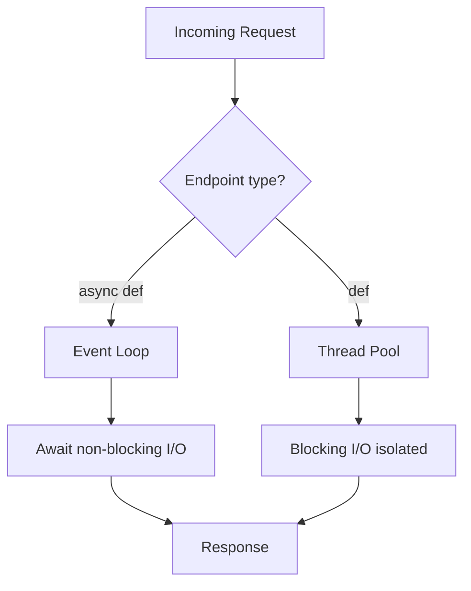

# Async/Await Deep Dive

The **`async def` vs `def`** choice is the #1 performance trap for FastAPI juniors. Get it wrong and you freeze the entire server for every user.

## The Restaurant Analogy

Imagine a restaurant:

- **Async waiter (`async def`)**: Takes your order, sends it to the kitchen (database or external API), and **while food cooks**, serves other tables.
- **Sync waiter (`def` in wrong place)**: Takes your order, **stands in the kitchen** until the dish is ready. Nobody else is served.

FastAPI's event loop is the dining room floor. **Blocking it starves everyone.**

## When to Use `async def`

```python
# ✅ CORRECT: Async database driver
@app.get("/users/{user_id}")
async def get_user(user_id: int, db: AsyncSession = Depends(get_db_session)):
    result = await db.execute(select(User).where(User.id == user_id))
    return result.scalar_one_or_none()

# ✅ CORRECT: Async HTTP client
import httpx

@app.get("/external")
async def fetch_external():
    async with httpx.AsyncClient() as client:
        response = await client.get("https://api.example.com/data")
    return response.json()
```

Use `async def` when **every** I/O call in the function is awaitable (non-blocking).

## The Deadly Mistake

```python
# 🔴 DANGER: async def + blocking library = frozen event loop
import requests

@app.get("/data")
async def get_data():
    # requests is synchronous — blocks the ENTIRE server
    response = requests.get("https://api.external.com/heavy-data")
    return response.json()
```

All concurrent requests wait behind this one blocking call.

## The Fix: Use `def` for Blocking Code

```python
# ✅ CORRECT: FastAPI runs sync functions in a thread pool
@app.get("/data-safe")
def get_data_safe():
    response = requests.get("https://api.external.com/heavy-data")
    return response.json()
```

FastAPI detects plain `def` and runs it in **`run_in_threadpool`** — the event loop stays free.

## Decision Matrix

| Your code uses... | Endpoint style |
|-------------------|----------------|
| `asyncpg`, `httpx`, `aiofiles` | `async def` + `await` |
| `requests`, sync SQLAlchemy, `time.sleep()` | `def` (thread pool) |
| Mix of both | Split into services; don't mix in one function |

## CPU-Bound Work

Neither `async def` nor `def` helps heavy CPU work (image processing, ML inference):

```python
from fastapi.concurrency import run_in_threadpool

@app.post("/process")
async def process_image(file: UploadFile):
    contents = await file.read()
    result = await run_in_threadpool(heavy_cpu_function, contents)
    return {"result": result}
```

For heavy loads, use **Celery** or a dedicated worker process.

## Flow Diagram



## Combat Checklist

- [ ] Async DB driver with `async def`?
- [ ] No `requests` / `time.sleep()` inside `async def`?
- [ ] CPU work offloaded to thread pool or worker?
- [ ] External APIs use `httpx` async client?

## Related Notes
- [ASGI vs WSGI](/learning/fastapi-asgi-vs-wsgi) - Event loop basics
- [Async Database Sessions](/learning/fastapi-async-database-sessions) - Async sessions
- [Background Tasks](/learning/fastapi-background-tasks) - Offload work after response
