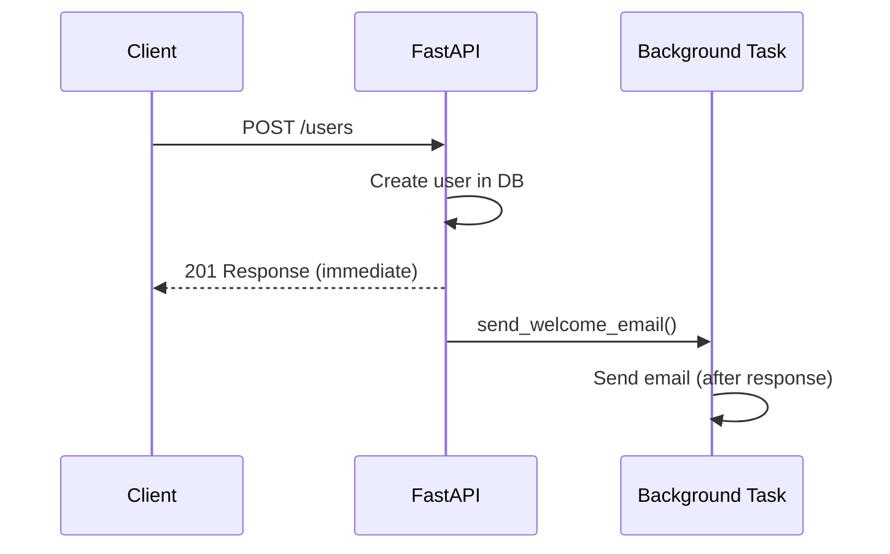

# Background Tasks

Sometimes you need work to run **after** sending the HTTP response (send email, write audit log, invalidate cache). FastAPI has built-in `BackgroundTasks`; heavier workloads need **Celery** or similar.

## Native `BackgroundTasks`

```python
from fastapi import BackgroundTasks

def send_welcome_email(email: str, username: str):
    # Sync function — runs after response is sent
    ...

@app.post("/users/", status_code=201)
async def create_user(
    user: UserCreate,
    background_tasks: BackgroundTasks,
    db: AsyncSession = Depends(get_db_session),
):
    db_user = await create_user_in_db(db, user)
    background_tasks.add_task(send_welcome_email, db_user.email, db_user.username)
    return db_user
```



## Async Background Tasks

```python
async def log_event(message: str):
    async with httpx.AsyncClient() as client:
        await client.post("https://logging.internal/events", json={"msg": message})

@app.post("/orders/")
async def create_order(
    order: OrderCreate,
    background_tasks: BackgroundTasks,
):
    ...
    background_tasks.add_task(log_event, f"Order {order_id} created")
    return {"id": order_id}
```

## Limitations of `BackgroundTasks`

| Limitation | Impact |
|------------|--------|
| Same process | Dies if server restarts mid-task |
| No retries | Failed email = lost unless you code retries |
| No scheduling | Can't run "every hour" |
| Memory pressure | Many tasks can pile up under load |

**Fine for**: emails, webhooks, cache invalidation, audit logs.

**Not fine for**: video encoding, payment processing, report generation.

## Celery (Production Heavy Work)

```python
# tasks.py
from celery import Celery

celery_app = Celery("worker", broker="redis://localhost:6379/0")

@celery_app.task(bind=True, max_retries=3)
def process_video(self, video_id: str):
    ...

# router
@app.post("/videos/")
async def upload_video(video_id: str):
    process_video.delay(video_id)
    return {"status": "processing"}
```

| Feature | BackgroundTasks | Celery |
|---------|-----------------|--------|
| Setup complexity | Zero | Redis/RabbitMQ + workers |
| Retries | Manual | Built-in |
| Persistence | No | Yes (broker) |
| Scale | Single server | Horizontal workers |

## Database Sessions in Background Tasks

```python
# ❌ BAD: Don't reuse request session
background_tasks.add_task(send_email, db, user.id)  # Session may be closed

# ✅ GOOD: Pass IDs, open new session in task
async def send_email_task(user_id: int):
    async with AsyncSessionLocal() as db:
        user = await db.get(User, user_id)
        ...
```

## Combat Tips

### ✅ DO
- Keep background functions small and idempotent
- Pass primitives/IDs, not ORM objects or sessions
- Use Celery when failure is costly (payments, compliance)

### ❌ DON'T
- Don't run long CPU work in BackgroundTasks — use Celery
- Don't assume task order — they're not a queue with guarantees
- Don't block the event loop inside async background tasks

## Related Notes
- [Async Await Deep Dive](/learning/fastapi-async-await-deep-dive) - Thread pool vs async
- [Global Error Handling](/learning/fastapi-global-error-handling) - Errors in tasks aren't HTTP errors
- [Async Database Sessions](/learning/fastapi-async-database-sessions) - Session per task
