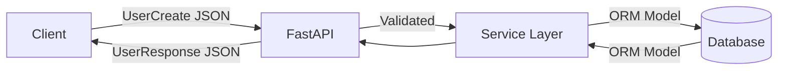

# Data Shaping: Input vs Output Schemas

In FastAPI, **never** return a raw database model directly to the client. Use Pydantic to **shape** what enters and what leaves your API. This is your security filter.

## The Pattern

| Schema | Purpose | Contains password? |
|--------|---------|-------------------|
| `UserCreate` | Request body (in) | ✅ Yes (plain, to be hashed) |
| `UserUpdate` | Partial updates | Maybe |
| `UserResponse` | API response (out) | ❌ Never |

```python
from pydantic import BaseModel, EmailStr, Field, ConfigDict

# What the user sends (Request)
class UserCreate(BaseModel):
    username: str = Field(..., min_length=3, max_length=20)
    email: EmailStr
    password: str = Field(..., min_length=8)

# What the API returns (Response)
class UserResponse(BaseModel):
    model_config = ConfigDict(from_attributes=True)

    id: int
    username: str
    email: EmailStr
    is_active: bool = True
    # Notice: no `password` field — security by design
```

Even if your SQLAlchemy model has `password_hash`, it never appears in `UserResponse`.

## `response_model` — The Protective Shield

```python
@app.post("/users", response_model=UserResponse, status_code=201)
async def create_user(
    user_data: UserCreate,
    db: AsyncSession = Depends(get_db_session),
):
    db_user = User(
        username=user_data.username,
        email=user_data.email,
        password_hash=hash_password(user_data.password),
    )
    db.add(db_user)
    await db.commit()
    await db.refresh(db_user)
    return db_user  # Has password_hash — FastAPI filters via UserResponse
```

FastAPI serializes through `UserResponse` — extra DB fields are stripped.

## Multiple Schemas per Resource

```python
class UserPublic(BaseModel):
    model_config = ConfigDict(from_attributes=True)
    id: int
    username: str

class UserPrivate(UserPublic):
    email: EmailStr
    is_active: bool
    created_at: datetime

@app.get("/users/{id}", response_model=UserPublic)
async def get_user_public(id: int, ...):
    ...

@app.get("/me", response_model=UserPrivate)
async def get_me(current_user: User = Depends(get_current_user)):
    return current_user
```

## `response_model_exclude` / `include`

```python
@app.get("/users/{id}", response_model=UserResponse, response_model_exclude={"email"})
async def get_user_redacted(id: int, ...):
    ...
```

Prefer separate schemas over excludes for clarity.

## List Responses

```python
@app.get("/users", response_model=list[UserResponse])
async def list_users(db: AsyncSession = Depends(get_db_session)):
    result = await db.scalars(select(User))
    return result.all()
```

## Combat Tips

### ✅ DO
- One schema per direction (create, update, read, list)
- Hash passwords in the service layer, not in Pydantic
- Use `from_attributes=True` for ORM → schema conversion

### ❌ DON'T
- Don't return `dict(user.__dict__)` — leaks internal fields
- Don't reuse `UserCreate` as response model
- Don't trust client to omit fields — validate inbound, filter outbound

## Data Flow



## Related Notes
- [Pydantic V2 Foundations](/learning/fastapi-pydantic-v2-foundations) - BaseModel basics
- [Custom Validators](/learning/fastapi-custom-validators) - Cross-field validation
- [Decoupling The ORM](/learning/fastapi-decoupling-the-orm) - ORM models vs Pydantic schemas
