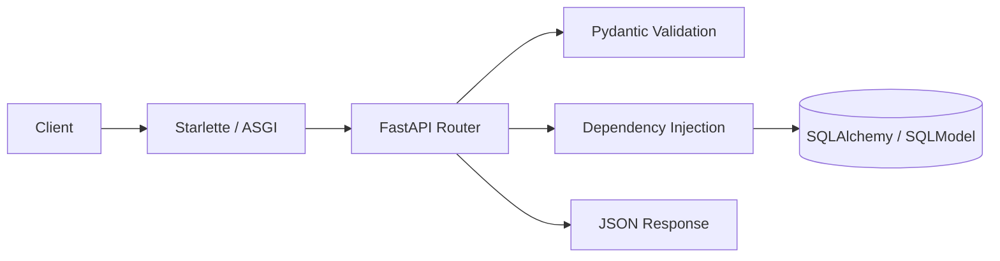

# FastAPI Master Note ⚡

> **FastAPI** is a modern, high-performance Python framework for building APIs. It excels at HTTP routing, lightning-fast data parsing/validation via **Pydantic**, and native concurrency with **async/await**.

## What is FastAPI?

FastAPI is a **minimalist microframework** — a precision-engineered piece of tooling. Unlike Django's batteries-included monolith (built-in ORM, auth, admin panel), FastAPI does three things exceptionally well and leaves the rest to you:

1. **Route HTTP requests**
2. **Parse and validate data** at C-speed via Pydantic
3. **Handle concurrency** natively with async/await

Because FastAPI has **no built-in ORM**, you externalize persistence (SQLAlchemy, SQLModel, Tortoise, etc.). That gives you brutal flexibility — but **you** are the system architect.



## FastAPI vs Django — When to Choose What

| Feature | Django | FastAPI |
|---------|--------|---------|
| **Philosophy** | Batteries-included monolith | Modular microframework (pick your pieces) |
| **ORM** | Built-in, sync by default (very mature) | External (SQLAlchemy/SQLModel, async-native) |
| **Validation** | Django Forms / DRF Serializers | Pydantic (data-layer validation, near C speed) |
| **Speed** | Standard | Top-tier (Starlette + Uvicorn) |
| **Learning curve** | Steeper ("The Django Way") | Gentler (plain Python + type hints) |
| **Best for** | Full web apps, admin, CMS, CRUD monoliths | APIs, microservices, real-time, ML inference endpoints |

## 🎓 Learning Paths

### 🟢 Track 1: "I'm new to FastAPI"
**Time: 1-2 days**

1. [ASGI vs WSGI](/learning/fastapi-asgi-vs-wsgi) - Understand the async runtime
2. [Declaring Endpoints](/learning/fastapi-declaring-endpoints) - Path, query, and body parameters
3. [Pydantic V2 Foundations](/learning/fastapi-pydantic-v2-foundations) - BaseModels and type hints
4. [The Dependency Injection](/learning/fastapi-the-dependency-injection) - The `Depends` system

**Build**: A CRUD API for a todo list (in-memory first)

---

### 🟡 Track 2: "I need a production API with a database"
**Time: 2-3 days**

**Prerequisites**: Track 1

1. [Data Shaping Schemas](/learning/fastapi-data-shaping-schemas) - Input vs output schemas
2. [Decoupling The ORM](/learning/fastapi-decoupling-the-orm) - SQLAlchemy / SQLModel setup
3. [Async Database Sessions](/learning/fastapi-async-database-sessions) - Session lifecycle with `Depends`
4. [Migrations with Alembic](/learning/fastapi-migrations-with-alembic) - Schema versioning

**Build**: User registration API with PostgreSQL

---

### 🔴 Track 3: "I'm shipping to production"
**Time: 1-2 days**

**Prerequisites**: Track 1 + 2

1. [Async Await Deep Dive](/learning/fastapi-async-await-deep-dive) - `async def` vs `def` (critical)
2. [Custom Validators](/learning/fastapi-custom-validators) - Advanced Pydantic
3. [Background Tasks](/learning/fastapi-background-tasks) - Native tasks vs Celery
4. [Global Error Handling](/learning/fastapi-global-error-handling) - Clean error responses

**Build**: Harden an existing API (errors, logging, async discipline)

---

## 📚 Content Index

### Core & Routing
- [ASGI vs WSGI](/learning/fastapi-asgi-vs-wsgi) - Uvicorn, Starlette, and the event loop
- [Declaring Endpoints](/learning/fastapi-declaring-endpoints) - Path, query, and body parameters
- [The Dependency Injection](/learning/fastapi-the-dependency-injection) - The `Depends` system

### Data Validation (Pydantic)
- [Pydantic V2 Foundations](/learning/fastapi-pydantic-v2-foundations) - BaseModels, type hints, strict typing
- [Data Shaping Schemas](/learning/fastapi-data-shaping-schemas) - Input vs output schemas (don't leak passwords)
- [Custom Validators](/learning/fastapi-custom-validators) - `@field_validator` and transformations

### Database & External ORMs
- [Decoupling The ORM](/learning/fastapi-decoupling-the-orm) - SQLAlchemy / SQLModel without coupling
- [Async Database Sessions](/learning/fastapi-async-database-sessions) - Session lifecycle with `Depends`
- [Migrations with Alembic](/learning/fastapi-migrations-with-alembic) - Django's `makemigrations` equivalent

### Concurrency & Advanced
- [Async Await Deep Dive](/learning/fastapi-async-await-deep-dive) - When to use `async def` vs `def`
- [Background Tasks](/learning/fastapi-background-tasks) - Native background tasks vs Celery
- [Global Error Handling](/learning/fastapi-global-error-handling) - Custom exception handlers

## 🛠️ Quick Reference

```bash
pip install "fastapi[standard]"
uvicorn main:app --reload
uvicorn main:app --host 0.0.0.0 --port 8000 --workers 4
```

```python
from fastapi import FastAPI

app = FastAPI(title="My API", version="1.0.0")

@app.get("/health")
async def health():
    return {"status": "ok"}
```

Interactive docs: `http://localhost:8000/docs` (Swagger) · `/redoc` (ReDoc)

## 🔗 External Resources

- [FastAPI Official Docs](https://fastapi.tiangolo.com/)
- [Pydantic V2 Docs](https://docs.pydantic.dev/)
- [SQLModel](https://sqlmodel.tiangolo.com/)
- [Starlette](https://www.starlette.io/)

## 📝 Notes

- 🟢 beginner · 🟡 intermediate · 🔴 advanced
- Combat tips and anti-patterns included — not a clone of official docs
- Focus on **why** you architect things this way

---

*Last updated: {{date}}*
