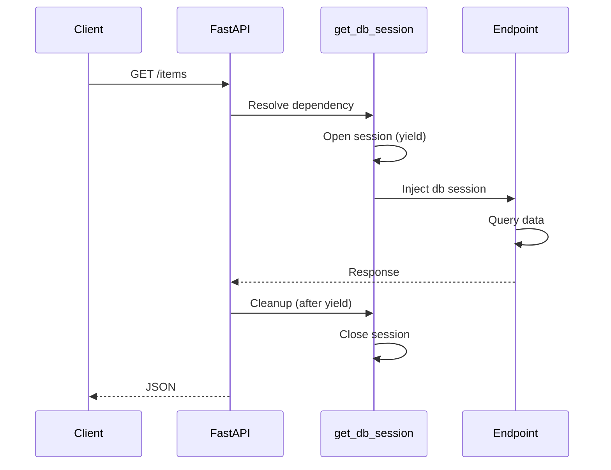

# The Dependency Injection System (`Depends`)

Because FastAPI externalizes everything (ORM, auth, config), you need a clean way to inject database sessions, current users, and settings into endpoints. **`Depends`** is FastAPI's crown jewel — automatic, testable, composable dependency injection.

## The Mental Model

Think of `Depends` as an **automatic provider**. Your endpoint says *"I need a database"* and FastAPI:

1. Opens a connection
2. Hands you the session
3. Closes it when the request ends (via `yield`)



## Database Session Provider

```python
# database/session.py
from sqlalchemy.ext.asyncio import AsyncSession, async_sessionmaker, create_async_engine

engine = create_async_engine(DATABASE_URL, echo=False)
AsyncSessionLocal = async_sessionmaker(engine, expire_on_commit=False)

async def get_db_session() -> AsyncSession:
    async with AsyncSessionLocal() as session:
        yield session  # Hand off clean session
        # Exiting async with closes session — no leaks
```

```python
# routers/items.py
from fastapi import Depends
from sqlalchemy.ext.asyncio import AsyncSession
from sqlalchemy import select

@app.get("/items")
async def read_items(db: AsyncSession = Depends(get_db_session)):
    result = await db.scalars(select(Item))
    return result.all()
```

## Dependency Chains

```python
async def get_current_user(
    token: str = Depends(oauth2_scheme),
    db: AsyncSession = Depends(get_db_session),
) -> User:
    payload = decode_token(token)
    user = await db.get(User, payload["sub"])
    if not user:
        raise HTTPException(status_code=401, detail="Invalid token")
    return user

@app.get("/me")
async def read_me(current_user: User = Depends(get_current_user)):
    return current_user
```

FastAPI resolves `get_current_user` → which needs `get_db_session` → builds the graph automatically.

## Class-Based Dependencies

```python
class Paginator:
    def __init__(self, skip: int = 0, limit: int = Query(20, le=100)):
        self.skip = skip
        self.limit = limit

@app.get("/posts")
async def list_posts(pagination: Annotated[Paginator, Depends()]):
    return await fetch_posts(pagination.skip, pagination.limit)
```

## `yield` Dependencies with Cleanup

```python
async def get_transactional_db():
    async with AsyncSessionLocal() as session:
        try:
            yield session
            await session.commit()
        except Exception:
            await session.rollback()
            raise
        finally:
            await session.close()
```

## Global Dependencies

```python
app = FastAPI(dependencies=[Depends(verify_api_key)])

@app.get("/public")
async def public():
    ...  # Still runs verify_api_key unless overridden
```

## Testing with Dependency Overrides

```python
from fastapi.testclient import TestClient

def get_mock_db():
    yield MockSession()

app.dependency_overrides[get_db_session] = get_mock_db
client = TestClient(app)
response = client.get("/items")
app.dependency_overrides.clear()
```

## Combat Tips

### ✅ DO
- Keep providers in `dependencies/` or `database/` modules
- Use `yield` for anything that needs teardown (DB, file handles, locks)
- Override dependencies in tests — never hit prod DB in unit tests

### ❌ DON'T
- Don't instantiate global sessions outside `Depends`
- Don't put heavy business logic inside dependency functions
- Don't create circular dependency chains

## Related Notes
- [Async Database Sessions](/learning/fastapi-async-database-sessions) - Session patterns in depth
- [Decoupling The ORM](/learning/fastapi-decoupling-the-orm) - ORM setup
- [Data Shaping Schemas](/learning/fastapi-data-shaping-schemas) - Inject validated schemas via dependencies
