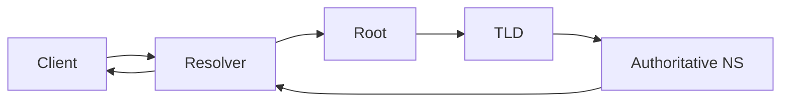

# DNS

> Domain Name System — distributed name resolution, resolver chain, record types, and security considerations.

The **Domain Name System (DNS)** is a **distributed database** that maps **human-friendly names** (for example `google.com`) to **machine-oriented data**, most famously **A/AAAA records** that return **[IP addresses](/learning/networking-ip-addresses-and-protocols)**.

Routers move packets using **addresses**, not names. People prefer names. Early networks used shared **`hosts` files**; that approach **does not scale** globally. DNS scales by **delegation**: each zone can answer for its subtree and refer queries upward.

---

## Why DNS exists

- People cannot memorize IP addresses at scale
- A **domain** is stable branding while **IPs change** (failover, migration, CDN)
- **Geo / latency routing** — return different A records per region
- **Load balancing** — multiple A records or CNAME to LB hostname

---

## Resolution chain (typical)

1. **Stub resolver** (OS / browser) asks a **recursive resolver** (ISP, `8.8.8.8`, etc.)
2. Resolver checks **cache** (honors **TTL**)
3. If miss: query **root** → **TLD** (.com) → **authoritative** name server for the zone
4. Answer cached and returned to the client

---

## Domain name shape

- Labels are written **left to right** from **most specific** to **TLD**: `www.google.com`.
- **Case-insensitive** in practice for ASCII names.
- **TLD** (top-level domain) is the rightmost label: `.com`, `.org`, `.jp`, …

### Common TLD categories

| Kind                   | Examples                                                                          |
| ---------------------- | --------------------------------------------------------------------------------- |
| Generic                | `.com`, `.org`, `.net`                                                            |
| Restricted / sponsored | `.gov`, `.mil`, `.edu` (policies vary)                                            |
| Country code           | `.de`, `.jp`, `.mx`, `.uk` (some registries use second-level rules like `.co.uk`) |
| New gTLDs              | `.dev`, `.app`, `.ai`, …                                                          |

---

## Owning a domain vs hosting a site

Buying a domain grants **control of a name in DNS**, not automatic hosting. You still need **authoritative DNS** (often from registrar or DNS provider) and **servers** (or a platform) that answer [HTTP](/learning/networking-http)/[HTTPS](/learning/networking-https) or other protocols.

### Registrar hygiene

Choose a **reputable registrar** with transparent renewal pricing and sane DNS tooling. Some providers have had **controversial practices** around **domain search data**; research current reputation before searching for brand domains.

### Privacy

**WHOIS** visibility varies by TLD and privacy services. **Registrar privacy** can reduce personal data exposure in public listings.

---

## Record types you will edit often

| Type      | Purpose                                                                  |
| --------- | ------------------------------------------------------------------------ |
| **A**     | Name → **IPv4** address                                                  |
| **AAAA**  | Name → **IPv6** address                                                  |
| **CNAME** | Alias one name to another canonical name                                 |
| **MX**    | Mail server for domain                                                   |
| **NS**    | Delegates subdomain to other name servers                                |
| **TXT**   | Arbitrary text: **SPF/DKIM**, domain verification, ACME challenges       |

Changes propagate by **TTL** (time-to-live): caches expire and refresh.

---

## Transport: [UDP](/learning/networking-udp) and [TCP](/learning/networking-tcp)

Most queries use **UDP** port **53** for speed. Large responses or zone transfers may use **TCP**. See [UDP](/learning/networking-udp) for trade-offs.

---

## Security

- **DNS is not encrypted by default** — observers on the network can see queries
- **DNS cache poisoning / hijacking** — spoofed answers if validation is weak
- **DNSSEC** — cryptographic signing of records (adoption varies)
- **DoT / DoH** — DNS over TLS / HTTPS for privacy (resolver trust shifts to provider)

---

## DNS in context

When you message someone or open a site, resolvers walk DNS so your device can open a **TCP/UDP socket** to an address. See [How the Internet Works](/learning/networking-how-the-internet-works).

---

## Related notes

- [IP Addresses and Protocols](/learning/networking-ip-addresses-and-protocols)
- [UDP](/learning/networking-udp), [TCP](/learning/networking-tcp)
- [HTTP](/learning/networking-http), [HTTPS](/learning/networking-https)
- [How the Internet Works](/learning/networking-how-the-internet-works)
- [Networking MOC](/learning/networking-master-moc)
