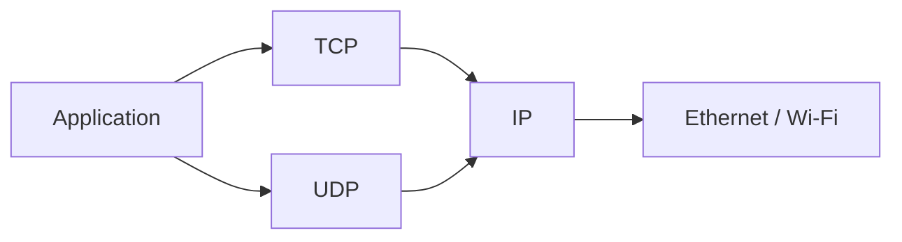

# IP (Internet Protocol)

> Internet Protocol — datagram delivery, headers, IPv4 vs IPv6, and its role in the network layer.

**IP** (Internet Protocol) is the **network-layer** protocol that moves **packets** (datagrams) from a source host toward a destination host across **multiple networks**. It provides **best-effort delivery**: no guarantee of arrival, order, or duplicate-free delivery — that is the job of [TCP](/learning/networking-tcp) or application logic.

---

## What IP does (and does not do)

**Does:**

- Assign **logical addresses** (see [IP Addresses and Protocols](/learning/networking-ip-addresses-and-protocols))
- **Fragment** oversized packets when required (IPv4; IPv6 handles this differently)
- Carry a **protocol number** so the receiver knows whether the payload is TCP, UDP, ICMP, etc.

**Does not:**

- Guarantee delivery (use [TCP](/learning/networking-tcp) or app-level retries)
- Preserve order (TCP handles ordering)
- Know about **ports** — that is transport layer ([TCP](/learning/networking-tcp) / [UDP](/learning/networking-udp))

---

## IPv4 vs IPv6

| Aspect | IPv4 | IPv6 |
| ------ | ---- | ---- |
| Address size | 32 bits (~4.3 billion) | 128 bits (effectively unlimited) |
| Typical notation | `203.0.113.10` | `2001:db8::1` |
| Header | 20+ bytes, variable options | Fixed 40-byte base header |
| NAT pressure | Heavy (address shortage) | Designed so every device *can* have global addresses |

Both coexist today (**dual stack**): resolvers may return **A** (IPv4) and **AAAA** (IPv6) records from [DNS](/learning/networking-dns).

---

## IP packet (simplified)

An IPv4 header includes (among other fields):

- **Source** and **destination** addresses
- **TTL** (Time To Live) — decremented each hop; prevents infinite loops
- **Protocol** — e.g. `6` = TCP, `17` = UDP
- **Total length**, **checksum**

Routers read the **destination address** and forward toward the next hop using **routing tables** (BGP between ISPs — outside this note).

---

## Relationship to other protocols

- [NAT](/learning/networking-nat) rewrites IP (and port) headers at network edge
- [TLS](/learning/networking-tls) encrypts **above** TCP; IP still sees source/dest addresses (metadata leak)

---

## For developers

- **Firewall rules** often filter on IP + port + protocol
- **Containers / Kubernetes** assign pod IPs at this layer — see cluster networking notes in DevOps section
- **Traceroute** uses TTL to discover hops
- Logs show **IP addresses**; users type **hostnames** resolved via [DNS](/learning/networking-dns)

---

## Related notes

- [IP Addresses and Protocols](/learning/networking-ip-addresses-and-protocols) — address formats and public/private space
- [NAT](/learning/networking-nat) — sharing public IPv4
- [TCP](/learning/networking-tcp), [UDP](/learning/networking-udp) — transport on top of IP
- [OSI Model](/learning/networking-osi-model) — IP at layer 3
