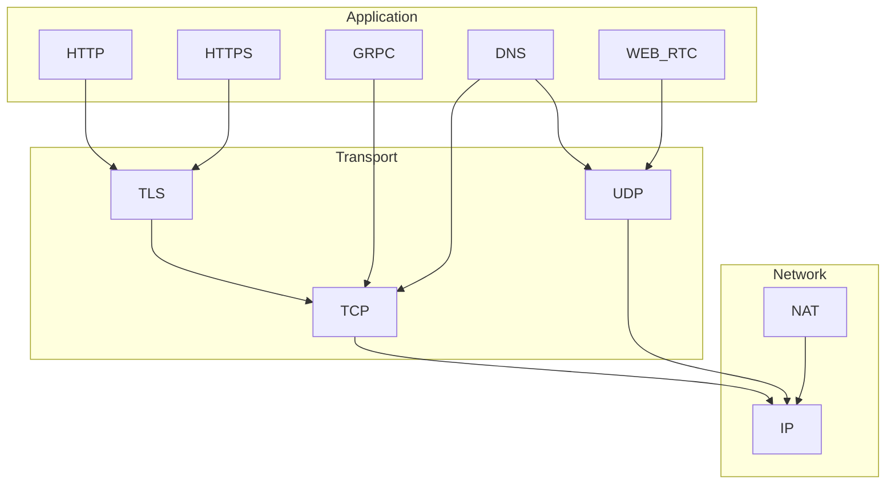

# Network Protocols Index

> Categorized index of protocol notes, organized by OSI-style layers. Add new notes here when you create them.

← [Networking MOC](/learning/networking-master-moc) · [OSI Model](/learning/networking-osi-model)

---

## Network layer (Layer 3)

Routing and logical addressing — how packets find their way across networks.

| Note | Description |
| ---- | ----------- |
| [IP](/learning/networking-ip) | Internet Protocol: datagrams, headers, IPv4 vs IPv6 at the protocol level |
| [IP Addresses and Protocols](/learning/networking-ip-addresses-and-protocols) | Address formats, public/private space, loopback, allocation |
| [NAT](/learning/networking-nat) | Network Address Translation: sharing one public IP among many private hosts |

---

## Transport layer (Layer 4)

End-to-end delivery between processes on different hosts (identified by IP + port).

| Note | Description |
| ---- | ----------- |
| [TCP](/learning/networking-tcp) | Connection-oriented, reliable, ordered byte stream |
| [UDP](/learning/networking-udp) | Connectionless datagrams — low latency, best-effort delivery |
| [TLS](/learning/networking-tls) | Encryption and authentication above TCP (also used by HTTPS, DoT, etc.) |

---

## Application layer (Layer 7)

Protocols that applications and developers interact with directly.

| Note | Description |
| ---- | ----------- |
| [DNS](/learning/networking-dns) | Domain names → records (A, AAAA, CNAME, TXT) |
| [HTTP](/learning/networking-http) | Request/response web protocol: methods, headers, status codes |
| [HTTPS](/learning/networking-https) | HTTP secured with TLS — ports, certificates, HSTS |
| [GRPC](/learning/networking-grpc) | High-performance RPC over HTTP/2 with Protocol Buffers |
| [WEB RTC](/learning/networking-webrtc) | Browser peer-to-peer real-time audio, video, and data |

---

## Cross-cutting map

---

## Adding a new protocol note

1. Create `Protocols/Your_Protocol.md` using System/Templates/Template Tech Note.
2. Set `category: "fundamentals"`, `subcategory: "networking"`, `slug: "networking-your-protocol"`.
3. Start the body with `# Title` and a `> summary` blockquote (feeds `description` in frontmatter).
4. Add a row to the appropriate section above.
5. Link related notes at the bottom under `## Related notes`.

**Slot for future notes** — uncomment or copy when you add files:

| Note | Layer | Status |
| ---- | ----- | ------ |
| DHCP | Network / App | Planned |
| ICMP | Network | Planned |
| QUIC / HTTP/3 | Transport / App | Planned |
| WebSockets | Application | Planned |
| BGP | Network | Planned |
