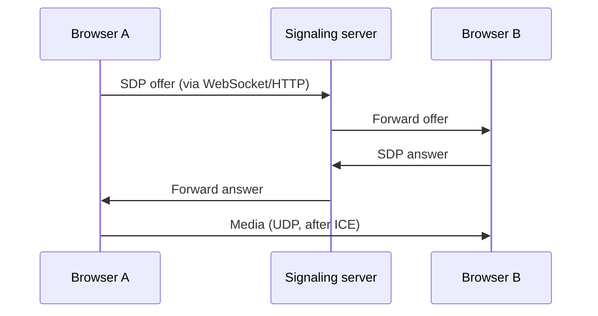

# WebRTC

> Browser real-time communication — peer connections, ICE/STUN/TURN, media over UDP, and data channels.

**WebRTC** (Web Real-Time Communication) enables **peer-to-peer** audio, video, and arbitrary **data channels** in browsers and native apps. It prioritizes **low latency** over [TCP](/learning/networking-tcp) reliability, so media typically flows over **[UDP](/learning/networking-udp)** (SRTP) with congestion control tailored for real-time traffic.

---

## Why not TCP for video?

[TCP](/learning/networking-tcp) retransmits lost packets → **jitter buffers** grow → call quality freezes. Live video often **drops** a frame instead of waiting. WebRTC uses UDP-based transports with **NACK**, **FEC**, and adaptive bitrate.

---

## Architecture (simplified)

**Signaling** (offer/answer, ICE candidates) is **not** standardized — you implement it (WebSocket, [HTTP](/learning/networking-http), etc.). **Media** goes **direct** when possible.

---

## Key protocols

| Piece | Role |
| ----- | ---- |
| **ICE** | Finds best path between peers (host, srflx, relay candidates) |
| **STUN** | Discovers public IP:port through [NAT](/learning/networking-nat) |
| **TURN** | Relays media when direct P2P fails (costs bandwidth) |
| **DTLS** | Key exchange for media (like [TLS](/learning/networking-tls) for UDP) |
| **SRTP** | Encrypted audio/video payloads |
| **SCTP / DataChannel** | Ordered/unordered app data over DTLS |

---

## NAT and firewalls

Most users sit behind **NAT**. Without STUN/TURN:

- Peers may not find a **routable** path
- Symmetric NAT is especially painful

Production WebRTC **always** plans for TURN servers.

---

## Security

- Browsers require **HTTPS** (or localhost) before `getUserMedia` camera/mic access
- DTLS-SRTP encrypts media; verify **identity** via signaling layer

---

## Common use cases

- Video conferencing (Meet, Zoom web, Discord)
- Live streaming with sub-second latency (vs HLS over [HTTP](/learning/networking-http))
- Multiplayer game state via **DataChannel**
- File transfer P2P (with app logic)

---

## Related notes

- [UDP](/learning/networking-udp) — primary transport for media
- [NAT](/learning/networking-nat) — why STUN/TURN exist
- [TLS](/learning/networking-tls) — conceptual parallel (DTLS)
- [DNS](/learning/networking-dns) — resolving TURN/STUN hostnames
