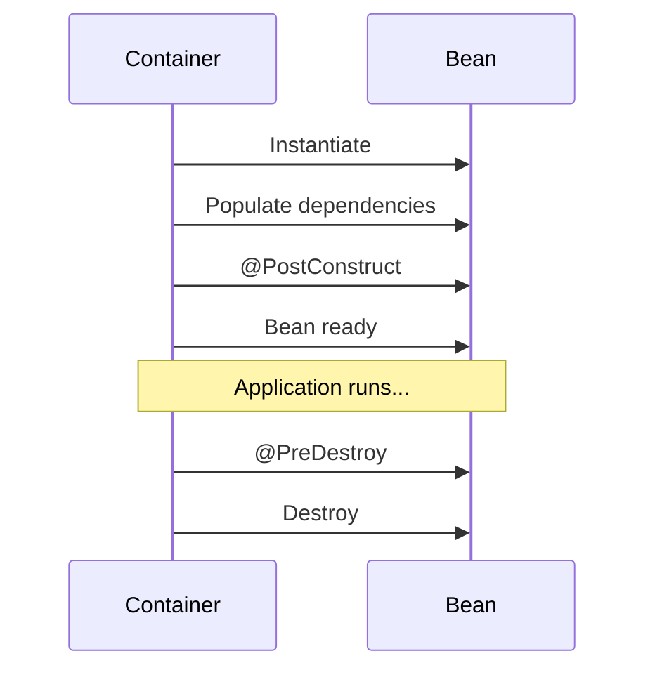

# Spring Core & IoC

> **Inversion of Control** means the framework creates and wires your objects — you describe *what* you need, not *how* to build the graph.

Spring Core is the **IoC container**. Everything else (Web, Data, Security) plugs into it as modules.

---

## What is Spring Core?

- **Dependency Injection container** — manages object graphs
- **Application framework** — cross-cutting infrastructure (events, AOP, resources)
- **Modular** — add only the JARs you need

```xml
<dependency>
    <groupId>org.springframework</groupId>
    <artifactId>spring-context</artifactId>
</dependency>
```

In Boot, `spring-boot-starter` pulls this in automatically.

---

## ApplicationContext vs Bean Factory

| | `BeanFactory` | `ApplicationContext` |
|---|---------------|----------------------|
| **Scope** | Core container | Superset (events, i18n, AOP) |
| **Eager init** | Lazy by default | Most singletons at startup |
| **Use in Boot** | Rarely directly | Always (via Spring Boot) |

```java
@SpringBootApplication
public class Application {
    public static void main(String[] args) {
        ApplicationContext ctx = SpringApplication.run(Application.class, args);
        UserService userService = ctx.getBean(UserService.class);
    }
}
```

---

## Defining Beans

### Component scanning (Boot default)

```java
@Service
public class OrderService {
    private final OrderRepository repository;

    public OrderService(OrderRepository repository) {
        this.repository = repository;
    }
}

@Repository
public interface OrderRepository extends JpaRepository<Order, Long> {}
```

`@SpringBootApplication` includes `@ComponentScan` on its package and sub-packages.

### Java `@Configuration` (explicit beans)

```java
@Configuration
public class AppConfig {

    @Bean
    public PasswordEncoder passwordEncoder() {
        return new BCryptPasswordEncoder();
    }

    @Bean
    public RestClient restClient(RestClient.Builder builder) {
        return builder.baseUrl("https://api.partner.com").build();
    }
}
```

Use `@Configuration` when you integrate third-party classes you can't annotate.

---

## Bean Lifecycle



```java
@Service
public class CacheWarmupService {

    @PostConstruct
    public void warmup() {
        // Runs after DI is complete — safe to use injected deps
    }

    @PreDestroy
    public void shutdown() {
        // Cleanup before container shutdown
    }
}
```

---

## Bean Scopes

| Scope | Description | Default? |
|-------|-------------|----------|
| `singleton` | One instance per container | ✅ Yes |
| `prototype` | New instance every injection | |
| `request` | One per HTTP request (web) | |
| `session` | One per HTTP session (web) | |

```java
@Component
@Scope(value = WebApplicationContext.SCOPE_REQUEST, proxyMode = ScopedProxyMode.TARGET_CLASS)
public class RequestAuditContext {
    private final Instant createdAt = Instant.now();
}
```

**Combat tip:** Don't make everything `prototype` — memory and GC pressure add up. Use request/session scope only when you truly need per-request state.

---

## Dependency Injection Styles

### Constructor injection (recommended)

```java
@Service
public class PaymentService {
    private final PaymentGateway gateway;
    private final AuditLogger auditLogger;

    // @Autowired optional when there's a single constructor (Spring 4.3+)
    public PaymentService(PaymentGateway gateway, AuditLogger auditLogger) {
        this.gateway = gateway;
        this.auditLogger = auditLogger;
    }
}
```

**Why seniors prefer this:**
- Dependencies are `final` — immutable, thread-safe
- Required dependencies are obvious in the constructor
- Easy to unit test without Spring (`new PaymentService(mock, mock)`)

### Field injection (avoid in production code)

```java
@Service
public class LegacyService {
    @Autowired
    private UserRepository repository;  // Hard to test, hides dependencies
}
```

### Setter injection (optional dependencies)

```java
@Service
public class NotificationService {
    private EmailClient emailClient;

    @Autowired(required = false)
    public void setEmailClient(EmailClient emailClient) {
        this.emailClient = emailClient;
    }
}
```

---

## `@Qualifier` — Multiple Implementations

```java
public interface PaymentGateway {
    void charge(Money amount);
}

@Service("stripeGateway")
public class StripeGateway implements PaymentGateway { ... }

@Service("paypalGateway")
public class PayPalGateway implements PaymentGateway { ... }

@Service
public class CheckoutService {
    private final PaymentGateway gateway;

    public CheckoutService(@Qualifier("stripeGateway") PaymentGateway gateway) {
        this.gateway = gateway;
    }
}
```

Or use `@Primary` on the default implementation.

---

## Combat Tips

### ✅ DO
- Prefer constructor injection and `final` fields
- Keep beans stateless when possible
- Use interfaces at injection points for testability

### ❌ DON'T
- Don't call `new` on services that should be managed beans
- Don't use field injection in new code
- Don't create circular dependencies — refactor or use `@Lazy` as last resort

---

## Related Notes
- [Autoconfiguration Lifecycle](/learning/spring-boot-spring-autoconfiguration) — How beans get auto-registered
- [Properties Profiles and YAML](/learning/spring-boot-spring-properties-profiles-yaml) — Injecting config values
- [Spring MOC](/learning/spring-boot-master-moc) — Learning roadmap
