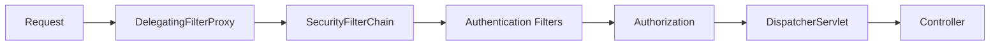

# Spring Security Architecture

> Security in Spring is a **filter chain** in front of your servlets. You configure rules, authentication mechanisms, and method-level checks — the framework handles the rest.

---

## Filter Chain Overview



```java
@Configuration
@EnableWebSecurity
@EnableMethodSecurity
public class SecurityConfig {

    @Bean
    public SecurityFilterChain securityFilterChain(HttpSecurity http) throws Exception {
        return http
            .csrf(csrf -> csrf.disable()) // APIs often disable CSRF (use tokens instead)
            .sessionManagement(session ->
                session.sessionCreationPolicy(SessionCreationPolicy.STATELESS))
            .authorizeHttpRequests(auth -> auth
                .requestMatchers("/actuator/health", "/api/v1/auth/**").permitAll()
                .requestMatchers("/api/v1/admin/**").hasRole("ADMIN")
                .anyRequest().authenticated())
            .oauth2ResourceServer(oauth2 -> oauth2.jwt(Customizer.withDefaults()))
            .build();
    }
}
```

---

## Stateless JWT Setup

### Security filter chain with JWT

```java
@Configuration
@EnableWebSecurity
@RequiredArgsConstructor
public class JwtSecurityConfig {

    private final JwtAuthenticationFilter jwtAuthFilter;
    private final AuthenticationProvider authenticationProvider;

    @Bean
    public SecurityFilterChain filterChain(HttpSecurity http) throws Exception {
        return http
            .csrf(AbstractHttpConfigurer::disable)
            .sessionManagement(s -> s.sessionCreationPolicy(SessionCreationPolicy.STATELESS))
            .authorizeHttpRequests(auth -> auth
                .requestMatchers("/api/v1/auth/login", "/api/v1/auth/register").permitAll()
                .anyRequest().authenticated())
            .authenticationProvider(authenticationProvider)
            .addFilterBefore(jwtAuthFilter, UsernamePasswordAuthenticationFilter.class)
            .build();
    }
}
```

### JWT filter (simplified)

```java
@Component
@RequiredArgsConstructor
public class JwtAuthenticationFilter extends OncePerRequestFilter {

    private final JwtService jwtService;
    private final UserDetailsService userDetailsService;

    @Override
    protected void doFilterInternal(HttpServletRequest request,
                                    HttpServletResponse response,
                                    FilterChain chain) throws ServletException, IOException {
        String authHeader = request.getHeader(HttpHeaders.AUTHORIZATION);
        if (authHeader == null || !authHeader.startsWith("Bearer ")) {
            chain.doFilter(request, response);
            return;
        }
        String token = authHeader.substring(7);
        String username = jwtService.extractUsername(token);

        if (username != null && SecurityContextHolder.getContext().getAuthentication() == null) {
            UserDetails user = userDetailsService.loadUserByUsername(username);
            if (jwtService.isTokenValid(token, user)) {
                var authToken = new UsernamePasswordAuthenticationToken(
                    user, null, user.getAuthorities());
                authToken.setDetails(new WebAuthenticationDetailsSource().buildDetails(request));
                SecurityContextHolder.getContext().setAuthentication(authToken);
            }
        }
        chain.doFilter(request, response);
    }
}
```

---

## Authentication Manager

```java
@Bean
public AuthenticationProvider authenticationProvider(
        UserDetailsService userDetailsService,
        PasswordEncoder passwordEncoder) {
    DaoAuthenticationProvider provider = new DaoAuthenticationProvider();
    provider.setUserDetailsService(userDetailsService);
    provider.setPasswordEncoder(passwordEncoder);
    return provider;
}

@Bean
public PasswordEncoder passwordEncoder() {
    return new BCryptPasswordEncoder();
}
```

```java
@Bean
public UserDetailsService userDetailsService(UserRepository repo) {
    return username -> repo.findByEmail(username)
        .map(u -> User.builder()
            .username(u.getEmail())
            .password(u.getPasswordHash())
            .roles(u.getRole())
            .build())
        .orElseThrow(() -> new UsernameNotFoundException(username));
}
```

---

## Method-Level Security

```java
@Service
public class OrderService {

    @PreAuthorize("hasRole('ADMIN') or #userId == authentication.principal.id")
    public Order getOrder(Long orderId, Long userId) {
        ...
    }

    @PostAuthorize("returnObject.ownerId == authentication.principal.id")
    public Order getOrderAfterAuth(Long orderId) {
        ...
    }
}
```

Enable with `@EnableMethodSecurity` on your security config.

---

## OAuth2 Resource Server (JWT from IdP)

```yaml
spring:
  security:
    oauth2:
      resourceserver:
        jwt:
          issuer-uri: https://login.example.com/realms/myrealm
```

```java
http.oauth2ResourceServer(oauth2 -> oauth2.jwt(Customizer.withDefaults()));
```

Validates JWTs from Keycloak, Auth0, Cognito, etc. — no custom filter needed.

---

## Combat Tips

### ✅ DO
- Use BCrypt or Argon2 for password hashing
- Short-lived access tokens + refresh token rotation
- Expose minimal public endpoints; secure Actuator

### ❌ DON'T
- Don't store JWT in localStorage if XSS is a risk — consider HttpOnly cookies for SPAs
- Don't disable security in prod "temporarily"
- Don't roll your own crypto — use `jjwt` or Spring OAuth2

---

## Related Notes
- [REST Controllers and MVC](/learning/spring-boot-spring-rest-controllers-mvc) — `@AuthenticationPrincipal`
- [Global Exception Handling](/learning/spring-boot-spring-global-exception-handling) — 401/403 responses
- [Authentication Permissions](/learning/django-authentication-permissions) — DRF comparison (vault)
