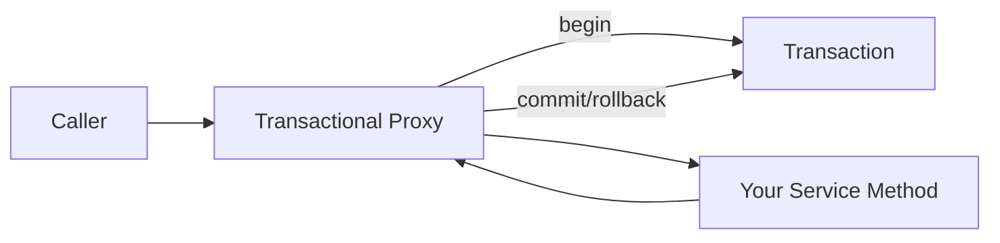

# Transaction Management

> **`@Transactional`** gives you declarative ACID boundaries. Understand proxies and propagation — or you'll debug "transaction not rolling back" at 2 AM.

---

## Enabling Transactions

```java
@SpringBootApplication
@EnableTransactionManagement // Often auto-enabled with JPA starter
public class Application { }
```

---

## Basic Usage

```java
@Service
public class TransferService {
    private final AccountRepository accounts;

    public TransferService(AccountRepository accounts) {
        this.accounts = accounts;
    }

    @Transactional
    public void transfer(Long fromId, Long toId, BigDecimal amount) {
        Account from = accounts.findById(fromId).orElseThrow();
        Account to = accounts.findById(toId).orElseThrow();

        from.debit(amount);
        to.credit(amount);

        // If any exception escapes (unchecked by default), both changes roll back
    }
}
```

```java
@Transactional(readOnly = true)
public List<Account> listAccounts() {
    return accounts.findAll();
}
```

---

## How Proxies Work

Spring wraps your bean in a **proxy**. The proxy starts/commits/rolls back the transaction **before and after** your method.



### The classic self-invocation trap

```java
@Service
public class OrderService {

    @Transactional
    public void placeOrder(OrderDto dto) {
        saveOrder(dto);
        // ❌ Calling internal method bypasses proxy — no transaction on saveOrder!
        this.saveOrderInternal(dto);
    }

    @Transactional
    public void saveOrderInternal(OrderDto dto) { ... }
}
```

**Fix:** Move `saveOrderInternal` to another bean, or call via injected self-interface.

---

## Propagation Behavior

| Propagation | Behavior |
|-------------|----------|
| `REQUIRED` (default) | Join existing TX or create new |
| `REQUIRES_NEW` | Always new TX — suspends current |
| `NESTED` | Nested savepoint (JDBC only) |
| `SUPPORTS` | Use TX if exists, else non-transactional |
| `NOT_SUPPORTED` | Suspend current TX |
| `MANDATORY` | Must run inside existing TX or fail |
| `NEVER` | Must not run inside TX |

```java
@Service
public class AuditService {
    @Transactional(propagation = Propagation.REQUIRES_NEW)
    public void writeAuditLog(String message) {
        // Commits even if outer transaction rolls back
        auditRepository.save(new AuditEntry(message));
    }
}
```

**Use case for `REQUIRES_NEW`:** Audit logs, outbox events that must survive parent rollback.

---

## Isolation Levels

| Level | Dirty read | Non-repeatable read | Phantom read |
|-------|------------|---------------------|--------------|
| `READ_UNCOMMITTED` | Possible | Possible | Possible |
| `READ_COMMITTED` | No | Possible | Possible |
| `REPEATABLE_READ` | No | No | Possible |
| `SERIALIZABLE` | No | No | No |

```java
@Transactional(isolation = Isolation.REPEATABLE_READ)
public BigDecimal calculateBalance(Long accountId) {
    ...
}
```

Default is usually DB default (`READ_COMMITTED` on PostgreSQL). Raise isolation only when you have proven concurrency bugs — it costs performance.

---

## Rollback Rules

```java
// Default: rollback on RuntimeException and Error, NOT on checked exceptions
@Transactional(rollbackFor = Exception.class)
public void importData() throws IOException {
    ...
}

@Transactional(noRollbackFor = BusinessWarningException.class)
public void process() { ... }
```

---

## Programmatic Transactions (Rare)

```java
@Service
public class BatchService {
    private final TransactionTemplate txTemplate;

    public BatchService(PlatformTransactionManager txManager) {
        this.txTemplate = new TransactionTemplate(txManager);
    }

    public void processBatch(List<Item> items) {
        for (Item item : items) {
            txTemplate.execute(status -> {
                repository.save(item);
                return null;
            });
        }
    }
}
```

Use when annotations don't fit (e.g., per-item TX in a loop).

---

## Combat Tips

### ✅ DO
- Keep transactions short — no HTTP calls inside `@Transactional`
- Use `readOnly = true` for queries (Hibernate optimization hint)
- Test rollback behavior with `@SpringBootTest` + `@Transactional` on tests (rolls back after test)

### ❌ DON'T
- Don't catch exceptions silently inside transactional methods
- Don't mix JPA lazy loading across transaction boundaries
- Don't use `REQUIRES_NEW` everywhere — complexity explodes

---

## Related Notes
- [JPA Hibernate and Data JDBC](/learning/spring-boot-spring-jpa-hibernate) — Persistence context
- [Global Exception Handling](/learning/spring-boot-spring-global-exception-handling) — Errors after rollback
- [Testing Slice Annotations](/learning/spring-boot-spring-testing-slices) — Transactional tests
