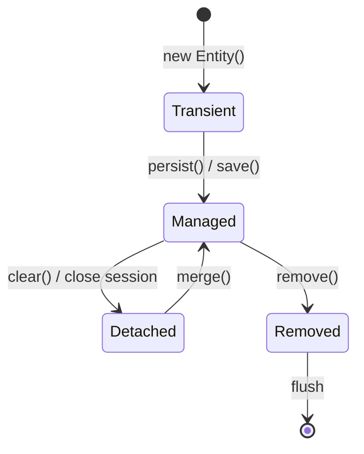

# JPA, Hibernate & Spring Data

> **Spring Data JPA** hides boilerplate CRUD behind repositories. **Hibernate** is the default JPA provider — powerful, but you must understand lazy loading and the session.

---

## Entity Basics

```java
@Entity
@Table(name = "users", indexes = @Index(columnList = "email"))
public class User {

    @Id
    @GeneratedValue(strategy = GenerationType.IDENTITY)
    private Long id;

    @Column(nullable = false, length = 100)
    private String name;

    @Column(nullable = false, unique = true)
    private String email;

    @OneToMany(mappedBy = "author", cascade = CascadeType.ALL, orphanRemoval = true)
    private List<Post> posts = new ArrayList<>();

    protected User() {} // JPA requires no-arg constructor

    public User(String name, String email) {
        this.name = name;
        this.email = email;
    }
}
```

---

## Repository Layer

```java
public interface UserRepository extends JpaRepository<User, Long> {

    Optional<User> findByEmail(String email);

    List<User> findByNameContainingIgnoreCase(String fragment);

    @Query("SELECT u FROM User u JOIN FETCH u.posts WHERE u.id = :id")
    Optional<User> findByIdWithPosts(@Param("id") Long id);
}
```

```java
@Service
@Transactional(readOnly = true)
public class UserService {
    private final UserRepository repository;

    public UserService(UserRepository repository) {
        this.repository = repository;
    }

    public User getById(Long id) {
        return repository.findById(id)
            .orElseThrow(() -> new UserNotFoundException(id));
    }

    @Transactional
    public User create(UserCreateDto dto) {
        return repository.save(new User(dto.name(), dto.email()));
    }
}
```

---

## Entity States (Persistence Context)



| State | Description |
|-------|-------------|
| **Transient** | New object, no DB row |
| **Managed** | Tracked by persistence context |
| **Detached** | Was managed, session closed |
| **Removed** | Scheduled for DELETE on flush |

**Combat tip:** Don't pass detached entities across threads or HTTP requests without `merge()`.

---

## Lazy vs Eager — The N+1 Problem

### The problem

```java
// ❌ N+1: 1 query for users + N queries for each user's posts
List<User> users = userRepository.findAll();
users.forEach(u -> u.getPosts().size()); // Lazy load triggers per user
```

### Solutions

**1. `JOIN FETCH` in JPQL**

```java
@Query("SELECT DISTINCT u FROM User u LEFT JOIN FETCH u.posts")
List<User> findAllWithPosts();
```

**2. `@EntityGraph`**

```java
@EntityGraph(attributePaths = {"posts"})
Optional<User> findWithPostsById(Long id);
```

**3. DTO projection (best for read APIs)**

```java
public record UserSummary(Long id, String name, long postCount) {}

@Query("""
    SELECT new com.example.UserSummary(u.id, u.name, COUNT(p))
    FROM User u LEFT JOIN u.posts p
    GROUP BY u.id, u.name
    """)
List<UserSummary> findAllSummaries();
```

| FetchType | When to use |
|-----------|-------------|
| `LAZY` | Default for collections — load on demand |
| `EAGER` | Rare — often causes accidental N+1 or huge graphs |

---

## Hibernate Proxies

Lazy associations are **proxies** — subclasses generated at runtime.

```java
// May throw LazyInitializationException outside @Transactional
User user = userRepository.findById(1L).orElseThrow();
user.getPosts().size(); // Session already closed
```

**Fix:** Keep work inside `@Transactional`, use `JOIN FETCH`, or DTOs.

---

## Second-Level Cache (L2)

Caches entities across sessions (EhCache, Caffeine, Redis via extensions).

```java
@Entity
@Cacheable
@org.hibernate.annotations.Cache(usage = CacheConcurrencyStrategy.READ_WRITE)
public class Product { ... }
```

```yaml
spring:
  jpa:
    properties:
      hibernate:
        cache:
          use_second_level_cache: true
          region:
            factory_class: org.hibernate.cache.jcache.JCacheRegionFactory
```

Use L2 for **read-heavy, rarely changed** reference data — not for everything.

---

## Spring Data JDBC (Alternative)

Lighter than JPA — no lazy loading, no persistence context. Good for simple CRUD microservices.

```java
@Table("orders")
public record Order(@Id Long id, String status, Instant createdAt) {}

public interface OrderRepository extends CrudRepository<Order, Long> {
    List<Order> findByStatus(String status);
}
```

| | Spring Data JPA | Spring Data JDBC |
|---|-----------------|------------------|
| **Complexity** | Higher | Lower |
| **Relationships** | Rich mapping | Manual joins |
| **Best for** | Domain models | Simple aggregates |

---

## Combat Tips

### ✅ DO
- Default to `LAZY` + explicit fetch strategies
- Use `@Transactional(readOnly = true)` on query services
- Paginate large lists: `Pageable`, `Slice`

### ❌ DON'T
- Don't expose entities directly in REST — use DTOs
- Don't use `open-in-view=true` as a crutch (disable in production APIs)
- Don't call `save()` in a loop — batch or `saveAll()`

---

## Related Notes
- [[02_Transaction_Management]] — Transaction boundaries
- [[01_Testing_Slice_Annotations]] — `@DataJpaTest`
- [[04_Advanced_ORM_Optimization]] — Django ORM comparison (vault)
